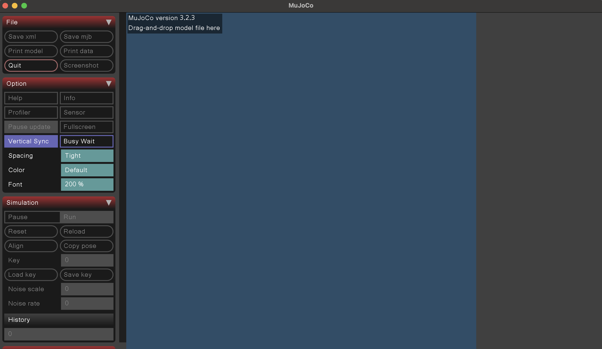
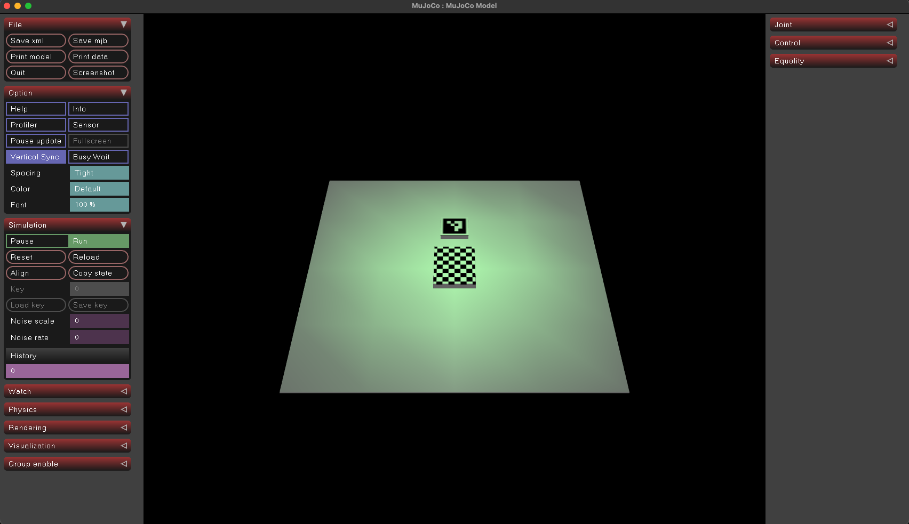

# Lab 1: Colab + MuJoCo

This lab has two parts:

1. Colab notebook introducing the basics of OpenCV (`lab1-public/cv_notebook`).
2. Local MuJoCo simulator: launching the viewer and exploring a simple world (`lab1-public/mujoco`).

## Preparation

All lab materials are [on GitHub](https://github.com/mim-ml-teaching/public-rc-2026-27). To clone the repository:

```bash
git clone https://github.com/mim-ml-teaching/public-rc-2026-27
cd public-rc-2026-27
```

Throughout the course, we use [`uv`](https://docs.astral.sh/uv/) as the package manager.
You don't have to know much about it to start working on the first lab.
Basically, each lab is a project that requires some dependencies (Python packages it needs to run).
This information lives in two files:

- `pyproject.toml`: what the project says it needs.
- `uv.lock`: the exact, pinned versions to ensure everyone gets the same environment.  

`uv` reads these files and resolves/installs what is required.

To avoid problems with the IDE (like VSCode) not detecting the correct python environment, instead of opening the entire repo, you may want to open a specific subdirectory of it. For example, when working with the notebook from Lab 1, you can open the `lab1-public/cv_notebook` directory; this way the python environment will be at the root of the workspace and will be automatically detected by your IDE. Each directory with a `pyproject.toml` file is a self-contained environment which you may open like that.

## Colab

Notebook: [Lab 1 Colab](https://colab.research.google.com/github/mim-ml-teaching/public-rc-2026-27/blob/main/docs/lab1-public/cv_notebook/lab1-colab-student.ipynb)

## MuJoCo

A significant portion of robotics work involves using simulators like MuJoCo.
This part introduces basic viewer usage. We will:

- (a) open the MuJoCo viewer,
- (b) load a simple world,
- (c) detect an existing ArUco marker,
- (d) generate a new marker,
- (e) make small XML edits.

All the files necessary are in `./mujoco` directory.

### MuJoCo viewer

Starting MuJoCo viewer is simple with `uv`:

```bash
cd lab1-public/mujoco
uv run python -m mujoco.viewer
```

A window should appear: 

### Loading the simulation world

With the viewer open, you can drag and drop `world1.xml` into the simulator window (you can also use `uv run python -m mujoco.viewer --mjcf path/to/xml`).
The file describes the simulation environment.
Assets location is evaluated in relation to the main `.xml` file, so make sure the `4x4_1000-0.png` file is in the correct location, as referenced in the `world1.xml` file.
You should now see the world loaded in the simulator:

Explore the MuJoCo interface.
Learn how to move the camera, zoom in and out, and rotate the view.

### Detecting Aruco markers

Now let's write a python script which detects Aruco markers within the simulation.

Take a look at the `capture_from_camera.py` script, where you can see a simple example of launching a Mujoco simulation, capturing a frame from the camera defined in `world1.xml` (see the `<camera>...</camera>` tag) and saving it to disk. Use e.g. `uv run capture_from_camera.py` from within the `lab1-public/mujoco` directory to run it.
Extend this script or write a new one and use OpenCV to detect the Aruco code in the captured frame. You can also change the position and orientation of the camera in the XML file to see how your detection works under different conditions.

*Hint:* you should use `cv2.aruco.DICT_4X4_1000` dictionary

### Generating new markers

Follow the instructions described in [this OpenCV tutorial](https://docs.opencv.org/4.x/d5/dae/tutorial_aruco_detection.html) to generate a new Aruco marker and add it to the scene.

Now use OpenCV to detect both Aruco markers in the scene and draw bounding boxes around them.

### Modifying the world

Change some of the box shapes in the world, e.g., use cylinders or spheres. Explore [the MuJoCo documentation](https://mujoco.readthedocs.io/en/stable/XMLreference.html) for available geom types.

## Notes

You may have noticed some objects appearing to float. In this lab the world is effectively static: the objects you see are geoms attached directly to the world (no joints, no dynamic bodies with mass/inertia), so they are not included for physics simulation like falling under gravity. In later labs we will add dynamic bodies, joints, and forces to make the simulations more realistic.

## References

- MuJoCo XML Reference: <https://mujoco.readthedocs.io/en/stable/XMLreference.html>
- OpenCV docs: https://docs.opencv.org
