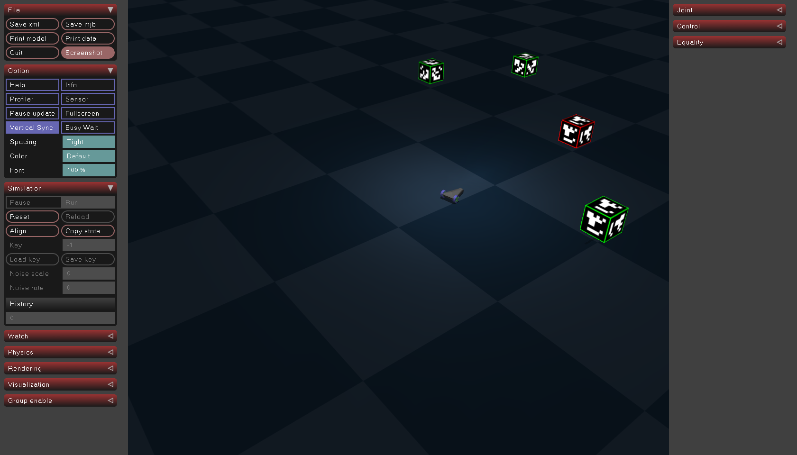
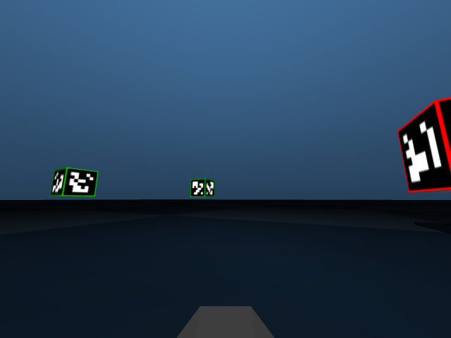
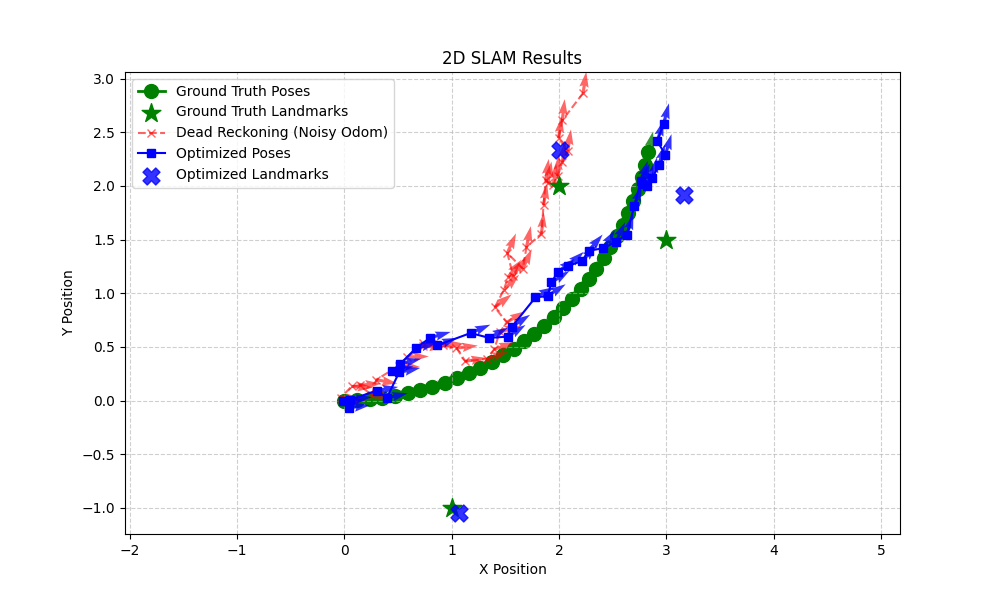

# Robot Control - Practical Exam - 2025 / 26 - Object detection and SLAM

## General description
**The goal of this task is to create a SLAM pipeline that uses odometry sensor and camera images.**

You are given a Mujoco environment with a simple driving car. 

The car is equipped with a camera mounted at it's top, facing forward. The view of the camera is as follows:

The car will be moving along a predefined trajectory in an environment with several landmarks:
cubes with AruCo codes on their sides.
Using SLAM pipeline, similar to the one covered during the labs,
you will estimate the trajectory of the car as well as the location of the landmarks. 

The task is split into two main parts:

### Image processing
In this part your main objective is to fill out missing code parts in `image_processing.py` file.
This will create a pipeline that extracts distances and (relative) angles from images of landmarks marked with AruCo tags.
For each image you should:
* Detect all aruco tags present.
* Filter out "bad" tags (more on this below).
* Estimate position and rotation of each tag relative to camera (car).
* For each tag estimate the landmark's distance and angle (in 2D relative to the car) that the tag marks, given the size of the cube it is on. 
* (optionally) Draw positions and ids of each aruco tag on each image.
Images will be saved to `debug` folder for your convenience.
This part **will not** be graded, but may be usefull for debugging.

When completed, this pipeline will result in a series of readings of distances and angles,
that can then be used to run a SLAM backend.

### AruCo tags
Landmarks are represented as cubes with AruCo tags (generated from `cv2.aruco.DICT_6X6_250` template) printed on their sides.
Tag on each cube face is the same.
The cubes are of different sizes, and you are given a dictionary mapping tag id to the cube size in meters.
This will be useful when estimating distance to the tag, and the distance to the cube center. 

Some of the landmarks are "bad".
All tags on a bad landmark have a red border around it, all tags on good landmark have green border around them.
You should filter out bad tags by implementing `check_is_tag_good` function in `image_processing.py`.
Only good tags should be used in SLAM backend.
It is guaranteed that each "good" landmark id is unique and corresponds to exactly one cube size.
This restriction **does not** apply when "bad" tags included.
This means that a tag with a given id can appear on a good landmark and a bad landmark in the same environment. 

Remember, that when viewed from an angle it is sometimes possible to see and detect multiple faces of the same cube (with the same tag) at once.
It is not necessary to treat those cases as two detections.
When estimating distance and angle to the landmark you can just use one of the visible faces and disregard the others.

The location of the landmark is defined as a center of the CUBE (not the tag).
Thus, after estimating the distance and angle to the tag,
you will have to calculate the position of the center of the cube that the given tag is on.

**IMPORTANT**
While the environment is 3D,
we only care about the position and relative distances of a car and landmarks in the 2D ground plane.
This means that the distance you estimate to each landmark should be the distance in the ground plane (x,y in mujoco),
and the angle should be the angle around the vertical axis (z in mujoco).
In particular this means that two landmarks at different heights but with the same (x,y) coordinates are always the same distance from the car.

### SLAM backend
In this part you will have to fill out a cost function in `backend_mujoco.py`.
This function, for a given guess (trajectory and landmark positions),
returns a cost representing how well this guess corresponds to observations (odometry measurements and camera readings).
This cost function is then used to find an optimal guess for trajectory and landmark positions by `scipy.optimize.minimize` function. 

Remember that not all landmarks are visible from each place in the trajectory.

After completing both parts you should be able to run the full SLAM pipeline by executing `python slam_mujoco.py [trajectory_path]`,
where `[trajectory_path]` points to a `.json` file specifying the environment and movements of the car.
9 trajectories (5 with bad tags and 4 without) are provided in `assets/trajectories` folder for testing and debuging purposes. 
During grading we will evaluate your code on a set of additional trajectories.
We suggest testing first on `python slam_mujoco.py assets/trajectories/slam_data_0.json`,
which is a simple and short trajectory, without bad tags - good for quick debugging.

After the program finishes execution,
a plot comparing dead reckoning odometry measurements and SLAM results with ground truth trajectory and landmark positions will be saved to `slam_result.png` file.

You can also run `python slam_mujoco.py --visualize` to see a rendering of the car moving through the environment.

SLAM results and optimization process are inherently stochastic, so your results may vary between runs.
On average the SLAM results should be better than odometry only results,
and landmarks should be close to their ground truth positions,
however there may be some runs where odometry only results are better by chance,
and a minority of landmarks are far from their ground truth positions.

## Submission
You should submit only the modified `image_processing.py` and `backend_mujoco.py` in a zipped folder.
You are not allowed to modify any other files.
Before submitting please make sure that your code runs without any errors when executing `python slam_mujoco.py`.

Code in files other than `image_processing.py` and `backend_mujoco.py` is not strictly necessary to solve the task.
You should be able to complete all TODO sections without reading through it.
However you may find it useful to go through the code to understand the data structures and flow of the program.
It might also be beneficial to change some constants for debugging purposes.
Remember that only changes in `image_processing.py` and `backend_mujoco.py` will be submitted and graded,
and thus any changes in other files will be lost.

You can only change code inside the `# TODO` sections.

Some of the tests will be automated.
If your program crashes you may be awarded 0 points.
Make sure to test your code before submission.
